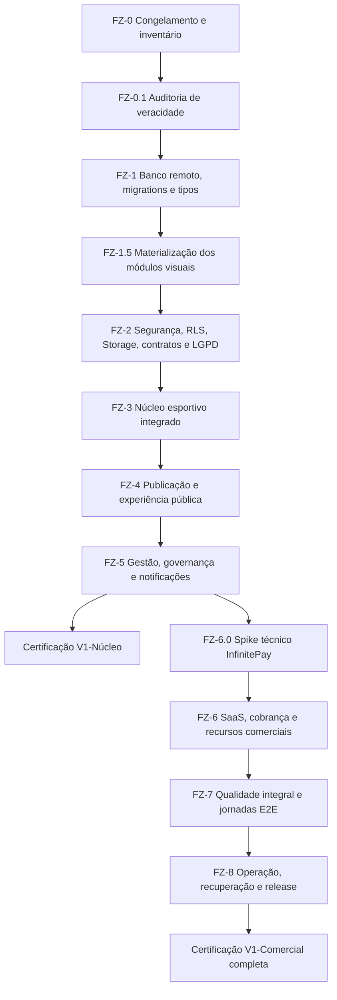

# PRD — Fechamento integral do IS Arena

**Produto:** IS Arena
**Repositório:** `competition-conductor`
**Versão:** 2.0 — substitui integralmente a v1.0 (29/07/2026)
**Status:** Plano executivo obrigatório para encerramento da V1
**Regra principal:** nenhum item deste PRD pode ser adiado, pulado ou aceito sem evidência

---

## 0. Changelog — o que mudou da v1.0 para a v2.0

A v1.0 foi auditada contra o estado real documentado do projeto e apresentava 10 lacunas estruturais. Esta versão incorpora as correções diretamente no corpo do documento:

1. **Seção 5** deixa de tratar financeiro/auditoria/notícias-mídia/patrocinadores/arbitragem como "já existentes" sem prova — isso agora é hipótese até a **FZ-0.1 (auditoria de veracidade)** confirmar.
2. Nova fase **FZ-1.5 — Materialização dos módulos visuais**, a ponte que faltava entre as telas já construídas com dados de demonstração e o backend real.
3. Nova fase **FZ-6.0 — Spike técnico InfinitePay**, com achados reais de pesquisa e o desenho correto (motor de assinatura interno, não recurso nativo do provedor).
4. **Seção 3** ganha divisão em dois tiers — **V1-Núcleo** e **V1-Comercial completa** — para permitir certificação e uso real antes do escopo comercial inteiro estar pronto.
5. Nova **Seção 8 — Estimativas de esforço por fase** (a v1.0 não tinha nenhuma).
6. **FZ-2** ganha requisitos de LGPD (dados pessoais de atletas, muitos menores de idade) e a regra geral de não confiar em payload de webhook sem confirmação servidor-a-servidor.
7. **FZ-7** ganha as jornadas E25–E27 (exportação/exclusão de dados, cancelamento, mudança de plano).
8. **FZ-8** ganha uma lista concreta de ferramental (a v1.0 pedia "monitoramento" e "alertas" sem nomear nada auditável).
9. Novo **Apêndice A** com sketch de schema para os 6 módulos pendentes.
10. Novo **Apêndice B** com ferramental recomendado.

Tudo o que já estava correto na v1.0 foi preservado. Este documento é autossuficiente — não é necessário consultar a v1.0.

---

## 1. Objetivo

Encerrar a implementação da V1 do IS Arena como uma aplicação SaaS plenamente
operável em produção, permitindo que uma organização:

1. crie e administre sua conta;
2. crie, configure e publique campeonatos;
3. gerencie equipes, atletas, responsáveis e comissões;
4. estruture fases, grupos, rodadas e confrontos;
5. opere partidas, eventos, escalações, arbitragem, súmulas e sanções;
6. publique notícias, mídias, patrocinadores e portais públicos;
7. controle o caixa operacional e a auditoria;
8. gerencie membros, papéis, notificações, plano, consumo e cobrança;
9. seja administrada com segurança pelo System Admin;
10. seja monitorada, recuperável e suportável em produção.

“100% funcional” neste documento não significa ausência matemática de qualquer
defeito futuro. Significa que **todo o escopo contratado da V1 está implementado,
integrado, protegido, testado e comprovado em produção**, sem mocks, placeholders,
decisões em aberto ou validações essenciais transferidas para depois — **e sem
suposições não verificadas sobre o que já existe**.

---

## 2. Resultado final obrigatório

A V1 somente poderá ser declarada encerrada quando, simultaneamente:

- a auditoria de veracidade (FZ-0.1) tiver confirmado, com evidência, o estado real de cada tabela/RPC/bucket citado neste documento — nada é aceito como "já existente" só porque está descrito em um plano anterior;
- todas as migrations locais estiverem aplicadas e registradas no banco remoto, incluindo as dos 6 módulos hoje visuais (arbitragem, financeiro, notícias/mídia, patrocinadores, auditoria);
- o schema remoto, os tipos TypeScript e o código estiverem sincronizados;
- todas as regras multi-tenant forem comprovadas por testes RLS autenticados;
- todas as jornadas críticas passarem em navegador com usuários reais de teste;
- todos os módulos visíveis estiverem funcionais, sem “Em breve” **e sem dado de demonstração** por trás de uma tela que parece funcional;
- não houver dados demonstrativos em caminhos de produção;
- os limites e módulos dos planos forem aplicados pelo backend;
- checkout, webhook e ciclo de assinatura funcionarem no ambiente publicado, com o motor de reconciliação descrito na FZ-6.0;
- backup e restauração tiverem sido executados com sucesso;
- logs, alertas, jobs, runbooks e rollback estiverem operacionais, usando ferramental nomeado (Apêndice B), não apenas descrito genericamente;
- direitos do titular de dados pessoais (exportação/exclusão) puderem ser exercidos sem intervenção manual direta no banco;
- lint, tipos, testes, cobertura e build estiverem verdes no CI;
- não houver severidade crítica ou alta aberta;
- o pacote de evidências de encerramento estiver completo.

Não são aceitos como prova isolada:

- botão oculto no frontend;
- teste apenas com `service_role`;
- SQL executado uma única vez sem script reproduzível;
- typecheck como prova de RLS;
- build local como prova de ambiente publicado;
- navegação manual sem asserções;
- “funciona na minha máquina”;
- funcionalidade parcialmente implementada com complemento prometido;
- **item marcado como "já existente" em um documento de planejamento anterior, sem verificação direta no schema remoto.**

---

## 3. Escopo final da V1

### 3.1 Divisão em tiers de certificação

Para não bloquear todo o produto atrás do escopo comercial mais pesado, a V1 é certificável em dois tiers sequenciais. Nenhum tier reduz segurança ou isolamento multi-tenant — o que se faseia é o comercial e a robustez operacional avançada.

| Tier | Conteúdo | Habilita |
| --- | --- | --- |
| **V1-Núcleo** | FZ-0 → FZ-1 → FZ-1.5 → FZ-2 → FZ-3 → FZ-4 → FZ-5, mais as jornadas E01–E17 e E22–E24, mais backup/restore e rollback de deploy do FZ-8 | Primeiro cliente pagante com cobrança manual/PIX direto, produto operando com segurança e sem mocks |
| **V1-Comercial completa** | Tudo do V1-Núcleo + FZ-6 (incluindo FZ-6.0) + jornadas E18–E21 e E25–E27 + FZ-7 e FZ-8 completos (multi-browser, WCAG AA formal, DR drill, alertas de produção) | Autoatendimento com cobrança automatizada, planos, API/embed Profissional e observabilidade de nível produção |

### 3.2 Incluído (ambos os tiers, salvo indicação)

- autenticação, recuperação de acesso e sessão;
- multi-tenancy por organização;
- membros, convites e papéis;
- campeonatos e identidade visual;
- equipes, atletas, elenco, staff e responsáveis;
- portal seguro de inscrição de equipe;
- configuração e motor de competição;
- fases, grupos, rodadas, confrontos e classificação;
- partidas, eventos, estatísticas e súmulas;
- escalações, substituições, arbitragem, sanções e suspensões;
- notícias, galeria, mídia, transmissões e patrocinadores;
- portal público da organização e do campeonato;
- financeiro como caixa operacional;
- auditoria de domínio e administrativa;
- notificações internas;
- System Admin básico e suporte controlado (V1-Núcleo: sem catálogo comercial automatizado);
- **planos, limites, assinatura e cobrança InfinitePay automatizados (V1-Comercial completa)**;
- **API JSON e incorporação HTML do plano Profissional (V1-Comercial completa)**;
- segurança, acessibilidade, responsividade, performance, CI/CD, backup e
  recuperação.

### 3.3 Fora da V1

Os itens abaixo não são pendências da V1 porque não integram seu contrato:

- aplicativo móvel nativo;
- marketplace de árbitros, equipes ou prestadores;
- hospedagem de streaming de vídeo;
- contabilidade fiscal, folha de pagamento e emissão de nota fiscal;
- bilheteria e venda de ingressos;
- IA para geração editorial;
- integrações com federações sem API e contrato definidos;
- domínio próprio por organização.

O “URL personalizado” dos planos significa um **slug exclusivo dentro do domínio
do IS Arena**, e não domínio próprio.

---

## 4. Decisões de produto encerradas

| Tema | Decisão final da V1 |
| --- | --- |
| Formatos | Pontos corridos, grupos, eliminatória e grupos + eliminatória |
| Turnos | Turno único e ida/volta |
| Desempate | Ordem configurável entre pontos, vitórias, saldo, gols pró, confronto direto e disciplina; sorteio somente como último critério explicitamente escolhido |
| Distribuição em grupos | Manual na V1; nenhum sorteio pseudoaleatório sem algoritmo versionado e reproduzível |
| Homologar/reabrir súmula | Somente `owner` e `admin`; `editor` opera rascunho e eventos, mas não homologa nem reabre |
| Acesso do árbitro | Cadastro e escala pela organização; árbitro não possui login próprio na V1 |
| Portal público | Somente campeonatos e conteúdo publicados; PII, documentos e dados internos nunca são expostos |
| Financeiro | Caixa operacional de receitas, despesas, baixas e estornos; não é ERP contábil/fiscal |
| Notificações | Internas e idempotentes na V1; não exibir preferência ou promessa de e-mail sem provedor transacional configurado |
| Planos | Pequeno R$ 25, Intermediário R$ 32, Grande R$ 40 e Profissional R$ 55 por mês |
| Limites comerciais | 300/3, 600/6, 900/12 e ilimitado/ilimitado para atletas/patrocinadores por campeonato |
| Campeonatos | Ilimitados nos quatro planos |
| Recursos não limitados no catálogo | Permanecem ilimitados na V1; `NULL` representa ilimitado de forma explícita |
| **Modelo de cobrança InfinitePay** | **Não existe assinatura recorrente nativa confirmada no provedor. A "assinatura" é um motor interno: geração de um novo link de checkout por ciclo, com o webhook tratado como gatilho e a confirmação de estado feita sempre por chamada servidor-a-servidor (`payment_check`) antes de qualquer renovação/liberação de acesso.** |
| Suporte | Leitura temporária, justificada, auditada e restrita à organização; sem compartilhamento de senha, escrita, financeiro ou impersonação irrestrita |
| API e incorporação | API JSON pública read-only e componente HTML read-only, exclusivos do Profissional e autorizados no backend |
| Retenção | 60 meses para auditoria de domínio e administrativa |
| Recuperação | RPO máximo de 24 horas e RTO máximo de 4 horas |
| Restauração | Teste trimestral e obrigatório antes do encerramento inicial |
| **LGPD** | **Dados de atleta (incluindo menores em categorias de base) tratados sob base legal a validar com jurídico; titular pode solicitar exportação e exclusão/anonimização; retenção pós-cancelamento de organização segue política própria, distinta da retenção de auditoria.** |

Qualquer alteração futura nessas decisões exige nova versão do produto, migration
compatível e atualização deste contrato. Não pode ser feita informalmente durante
o fechamento.

---

## 5. Estado de partida auditado

### 5.1 Regra de tratamento do estado atual

Nenhum item deste PRD pode ser tratado como "já implementado" sem evidência direta (comando executado + saída) produzida na **FZ-0.1**. Isso é necessário porque a versão anterior deste documento assumia como prontos módulos que, pelo histórico documentado do próprio projeto, ainda estavam na fase de **construção visual com dados de demonstração** — a estratégia adotada foi "visual gate antes do backend gate": telas de Arbitragem, Financeiro, Notícias e mídia, Patrocinadores e Auditoria foram construídas com dado fixo, rotulado como "dados de demonstração", justamente porque as tabelas correspondentes (`referees`, `financial_transactions`, `news`, `media`, `sponsors`, `audit_logs`) ainda não existiam no backend.

### 5.2 Itens a confirmar (hipótese, não fato, até a FZ-0.1)

- arquitetura React 19, TanStack Start/Router, TanStack Query e Supabase — **confirmado pelo próprio código**, sem necessidade de nova evidência;
- cockpit contextual por campeonato — **confirmado** (Etapas 1-4 do plano de reformulação já entregues e validadas);
- motor de competição e operação esportiva (Fases 1-3 do PRD de fases 0-6) — **a confirmar**: nível real de conclusão precisa ser medido, não assumido;
- publicação, financeiro, auditoria, notificações e gestão de membros — **a confirmar**: pelo histórico mais recente, esses módulos estavam em fase visual com mock;
- catálogo comercial, assinatura, suporte e System Admin — **a confirmar**: mesmo risco;
- tema e componentes compartilhados — **confirmado**;
- testes unitários, SQL e smoke público — **a confirmar** o nível de cobertura real;
- workflow de CI e comandos de qualidade — **a confirmar**.

### 5.3 Lacunas conhecidas e obrigatórias

| ID | Lacuna | Consequência se não corrigida |
| --- | --- | --- |
| L00 | Schema de Arbitragem, Financeiro, Notícias/Mídia, Patrocinadores e Auditoria pode não existir — telas atuais podem ser só visuais com dado de demonstração | Sem esta correção, FZ-3/FZ-4/FZ-5 não têm o que "religar"; tratado agora pela FZ-1.5 |
| L00b | Catálogo comercial/assinatura/System Admin podem estar no mesmo estado | Mesmo risco do L00, aplicado ao módulo SaaS inteiro; tratado pela FZ-6 |
| L01 | Migrations de reparo de elenco e Storage de logo precisam de aplicação e prova remota | Runtime pode divergir do repositório |
| L02 | Verificação de privacidade de árbitros não está na matriz automatizada principal | Regressão de PII pode passar despercebida |
| L03 | Tipos Supabase não representam integralmente os RPCs recentes | Casts ocultam schema drift |
| L04 | Existem adaptadores `untyped`/casts em serviços críticos | Perda de segurança estática e risco de contrato incorreto |
| L05 | E2E autenticado atual é insuficiente e não cobre jornadas completas | Fluxos integrados não estão comprovados |
| L06 | CI executa apenas smoke público de navegador | Regressões autenticadas podem chegar à produção |
| L07 | API JSON e incorporação HTML são anunciadas, mas precisam de implementação funcional | Plano Profissional vende recurso inexistente |
| L08 | Limites futuros de organização/storage/módulo não têm cobertura autoritativa completa | Alteração de catálogo pode não ser aplicada |
| L09 | Ciclo real de checkout/webhook precisa de prova no runtime publicado, **sob o modelo correto de motor interno (ver FZ-6.0)** | Cobrança pode funcionar apenas no banco, ou pode estar desenhada sobre um recurso que o provedor não oferece |
| L10 | Primeira execução real do job de ciclo de assinatura precisa ser registrada | Assinaturas vencidas podem não ser reconciliadas |
| L11 | Restauração de backup, RPO/RTO e retenção precisam de evidência operacional | Recuperação de desastre não comprovada |
| L12 | Rate limit, acessibilidade, compatibilidade e performance não têm matriz final, **nem ferramental nomeado** | Produção pode ser insegura ou inutilizável em cenários reais, e o gate não é auditável |
| L13 | Autorizações de homologação/reabertura precisam refletir a decisão final | Editor pode receber poder superior ao necessário |
| L14 | Promessas de e-mail sem provedor devem ser removidas ou bloqueadas | Interface promete comportamento inexistente |
| L15 | **LGPD não tratada:** direitos do titular, base legal para dados de menores, retenção pós-cancelamento | Exposição legal e operacional em produto brasileiro com dados de atletas menores de idade |

---

## 6. Princípios de execução

1. **Veracidade antes de tudo:** nada é considerado pronto porque um plano anterior disse que estava — só a evidência de FZ-0.1 conta.
2. **Banco antes do runtime:** migrations, grants, constraints, índices e RLS
   precedem o consumo pela interface.
3. **Backend como autoridade:** papéis, limites, assinatura e módulos não podem
   depender de UI.
4. **Fail-closed:** erro ou contexto ambíguo resulta em negação, nunca ampliação
   de acesso.
5. **Uma fonte de verdade:** não duplicar cálculo esportivo, saldo, assinatura ou
   consumo entre navegador e banco. Pagamento externo (webhook) nunca é fonte de
   verdade sozinho — sempre reconciliado por chamada servidor-a-servidor.
6. **Atomicidade e idempotência:** eventos, placar, súmula, avanço, estorno,
   convite e webhook suportam retry sem duplicação.
7. **Sem destruição implícita:** downgrade, migração ou regeneração não apaga
   histórico automaticamente.
8. **Evidência reproduzível:** toda aprovação precisa de comando, resultado,
   ambiente, data e responsável.
9. **Produção é um gate:** homologação local não substitui smoke e observabilidade
   do deploy, e observabilidade significa ferramenta nomeada, não descrição genérica.
10. **Sem dívida de encerramento:** `TODO`, `FIXME`, placeholder, mock e bypass
    relacionados ao escopo impedem o aceite — inclusive dado de demonstração
    remanescente atrás de uma tela aparentemente funcional.
11. **Conformidade com dados pessoais:** qualquer entidade que armazene documento,
    data de nascimento, contato ou imagem de pessoa física — inclusive menores de
    idade em categorias de base — segue a política de retenção e direitos do
    titular definida na FZ-2, sem exceção por conveniência de prazo.

---

## 7. Ordem obrigatória de fechamento



Nenhuma fase pode ser pulada. Trabalho preparatório pode ocorrer em paralelo, mas
o gate da fase anterior precisa estar aprovado antes do aceite da seguinte. A
certificação V1-Núcleo é um marco legítimo e público, não uma pendência
disfarçada — ela permite operar comercialmente de forma manual enquanto FZ-6 a
FZ-8 avançam.

---

## 8. Estimativas de esforço por fase

A ausência de estimativa impede qualquer gestão realista de prazo. Faixas abaixo assumem execução com apoio de IA para geração/revisão de código (Claude Code/Codex), não greenfield manual.

| Fase | 1 desenvolvedor | 2 desenvolvedores |
| --- | ---: | ---: |
| FZ-0 (+ FZ-0.1) | 3–5 dias | 2–3 dias |
| FZ-1 | 1–2 semanas | 4–7 dias |
| FZ-1.5 | 1,5–3 semanas | 1–2 semanas |
| FZ-2 | 1,5–2,5 semanas | 1–1,5 semana |
| FZ-3 | 2–3 semanas | 1,5–2 semanas |
| FZ-4 | 1,5–2,5 semanas | 1–1,5 semana |
| FZ-5 | 1,5–2,5 semanas | 1–1,5 semana |
| **Marco V1-Núcleo** | **~12–19 semanas acumuladas** | **~8–12 semanas acumuladas** |
| FZ-6.0 + FZ-6 | 3–5 semanas | 2–3 semanas |
| FZ-7 | 2–3 semanas | 1,5–2 semanas |
| FZ-8 | 1–2 semanas | 1 semana |
| **Marco V1-Comercial completa** | **~18–29 semanas acumuladas** | **~12,5–18 semanas acumuladas** |

Estas faixas devem ser revisadas assim que a FZ-0.1 confirmar quanto do "estado preservado" da Seção 5 realmente existe — se a maior parte estiver de fato pronta, os números caem; se estiver em mock, ficam no teto da faixa.

---

## 9. FZ-0 — Congelamento, inventário e auditoria de veracidade

### Objetivo

Estabelecer uma fotografia **comprovada** do que será encerrado e impedir que
novas features alterem o alvo durante a estabilização.

### Entregas

1. **FZ-0.1 — Auditoria de veracidade (primeira entrega, bloqueante):** rodar
   `supabase db diff` (ou inspeção equivalente do schema remoto) e produzir uma
   tabela objetiva — para cada tabela citada neste PRD (`referees`,
   `referee_assignments`, `financial_transactions`, `payments`, `news`, `media`,
   `sponsors`, `audit_logs`, `admin_audit_logs`, `support_sessions`, `plans`,
   `subscriptions`, `feature_flags`) — **existe / não existe / existe
   parcialmente**, com evidência (comando + saída). Nenhuma fase seguinte pode
   assumir "já existe" sem essa evidência anexada à matriz de rastreabilidade.
2. registrar commit, branch, versão do Node, npm, Supabase CLI e ambiente;
3. confirmar árvore Git limpa e migrations locais/remotas;
4. inventariar todas as rotas, menus, módulos, RPCs, tabelas, views, triggers,
   policies, buckets, cron jobs e variáveis de ambiente;
5. localizar `TODO`, `FIXME`, “Em breve”, mocks, dados fixos e casts de contrato
   — com atenção especial às seis áreas citadas na Seção 5;
6. mapear cada requisito deste PRD para código, SQL e teste;
7. classificar defeitos por criticidade;
8. definir responsáveis técnicos e sequência de correções;
9. congelar novas features até a certificação do tier correspondente.

### Critérios de aceite

- tabela de veracidade da FZ-0.1 completa, com evidência para cada item;
- matriz de rastreabilidade com 100% dos requisitos;
- nenhuma rota ou módulo órfão;
- toda divergência local/remota identificada;
- lista de defeitos críticos/altos zerada ou vinculada a item deste plano;
- baseline de qualidade registrado sem ocultar falhas.

### Evidência

`RELATORIO_FECHAMENTO_FZ0_INVENTARIO.md` (incluindo a tabela de veracidade da
FZ-0.1), logs dos comandos e hash do commit.

---

## 10. FZ-1 — Banco remoto, migrations e tipos

### Objetivo

Fazer o repositório, o histórico de migrations, o schema remoto e os tipos
gerados representarem exatamente o mesmo contrato **para tudo que a FZ-0.1
confirmou existir**. Tabelas identificadas como ausentes (L00/L00b) não entram
nesta fase — elas são desenho novo e pertencem à FZ-1.5.

### Entregas

1. Criar/confirmar ambiente de homologação descartável e separado de produção.
2. Aplicar e verificar em homologação todas as migrations em ordem.
3. Aplicar e registrar no remoto as migrations ainda locais confirmadas pela
   FZ-0.1 (por exemplo, reparo de elenco e Storage de logo, se a auditoria
   confirmar que já existem localmente e faltam no remoto).
4. Criar verificação específica do bucket, policies, upload, substituição e
   remoção segura do logo.
5. Incluir a verificação de privacidade de árbitros na matriz principal de
   testes, condicionada à FZ-1.5 já ter criado a tabela `referees`.
6. Rodar lint/diff do banco e inspecionar funções `SECURITY DEFINER`,
   `search_path`, grants e owners.
7. Validar FKs, unicidade, checks, índices e cardinalidade dos filtros críticos.
8. Regenerar `src/integrations/supabase/types.ts` a partir do remoto aprovado.
9. Substituir casts e clientes `untyped` por contratos gerados — apenas para o
   que já existe; o que depende da FZ-1.5 é tratado lá.
10. Validar a sequência completa em banco vazio e em cópia sanitizada de
    estrutura existente.
11. Documentar rollback operacional de cada migration de fechamento.

### Critérios de aceite

- histórico local e remoto sem diferença, para o escopo confirmado pela FZ-0.1;
- migrations funcionam do zero e sobre o estado existente;
- matriz SQL completa passa em homologação;
- zero RPC usado pelo app ausente nos tipos gerados;
- zero cast criado apenas para contornar contrato Supabase, no escopo já existente;
- nenhum warning crítico do lint/diff do banco;
- rollback documentado e testado onde for reversível.

### Evidência

Saída da CLI, resultado de cada SQL, diff do schema, arquivo de tipos e relatório
`RELATORIO_FECHAMENTO_FZ1_BANCO.md`.

---

## 11. FZ-1.5 — Materialização dos módulos visuais

### Objetivo

Transformar cada módulo hoje construído apenas como interface com dados de
demonstração em módulo real — sem redesenhar a UI já validada — para os seis
candidatos identificados na Seção 5: Arbitragem, Financeiro, Notícias e mídia,
Patrocinadores, Auditoria, e (se a FZ-0.1 confirmar ausência) o núcleo comercial
do System Admin.

### Entregas, por módulo

Para cada módulo confirmado como ausente/mock pela FZ-0.1:

1. Desenhar o schema (ponto de partida no **Apêndice A** deste documento).
2. Escrever migration idempotente + policies RLS por `organization_id` (e
   `championship_id` quando aplicável) + índices.
3. Regenerar tipos e criar o hook/service tipado seguindo o padrão já
   estabelecido no projeto (`useReferees(championshipId)`,
   `useFinancialTransactions(championshipId, filters)`,
   `useNews(championshipId)`, `useMedia(championshipId)`,
   `useSponsors(championshipId)`, `useAuditLogs(organizationId, filters)`).
4. Religar o componente visual já existente ao hook real, removendo o
   array/objeto de mock e qualquer rótulo de "dados de demonstração".
5. Adicionar loading, vazio, erro e confirmação de exclusão, quando ainda não
   presentes na versão visual.
6. Registrar escrita relevante (criação, edição, exclusão, publicação) na
   tabela `audit_logs` assim que ela existir.

### Ordem recomendada dentro da fase

1. `audit_logs` primeiro — os módulos seguintes já nascem auditados.
2. `referees` + `referee_assignments`.
3. `financial_transactions`.
4. `media` + `news`.
5. `sponsors`.
6. Núcleo comercial do System Admin, se a FZ-0.1 confirmar ausência (fica como
   pré-requisito de dados para a FZ-6, mas o desenho de schema já é feito aqui).

### Critérios de aceite

- nenhuma tela sob `/championships/:id/{arbitragem,financeiro,midia,
  patrocinadores,auditoria}` importa ou referencia um array estático — 100% dos
  dados vêm de `useQuery`/mutations contra o Supabase;
- cada módulo tem RLS testada com pelo menos dois tenants diferentes;
- nenhum badge "dados de demonstração" restante na interface;
- auditoria de domínio registra as ações administrativas dos próprios módulos
  recém-criados.

### Evidência

Migrations aplicadas + diff de schema, screenshots antes/depois da religação,
resultado dos testes RLS por módulo, relatório
`RELATORIO_FECHAMENTO_FZ1_5_MATERIALIZACAO.md`.

---

## 12. FZ-2 — Segurança, RLS, Storage, contratos e LGPD

### Objetivo

Comprovar isolamento multi-tenant, menor privilégio e conformidade com dados
pessoais em todas as superfícies.

### Matriz de identidades obrigatória

- anônimo;
- autenticado sem organização;
- owner, admin, editor e viewer da organização A;
- owner, admin, editor e viewer da organização B;
- responsável com token válido, expirado, bloqueado e revogado;
- usuário comum tentando atuar como System Admin;
- System Admin;
- suporte ativo, expirado e fora do escopo autorizado;
- webhook válido, inválido, repetido e fora da janela esperada.

### Entregas

- testar `SELECT`, `INSERT`, `UPDATE` e `DELETE` em todas as tabelas expostas,
  incluindo as criadas na FZ-1.5;
- testar todas as RPCs com tenant correto, tenant incorreto e recurso inexistente;
- testar buckets e objetos com paths válidos, cross-tenant e MIME/tamanho inválidos;
- garantir que PII de árbitros, atletas, responsáveis e usuários não apareça em
  respostas públicas;
- aplicar autorização específica por ação, sem confiar apenas em
  `can_administer_org`;
- restringir homologação e reabertura de súmula a owner/admin;
- confirmar viewer somente leitura;
- aplicar módulos e limites contratados no backend;
- implementar rate limiting para autenticação, convites, tokens, uploads,
  checkout, webhooks, API JSON e endpoints públicos;
- validar CSRF, XSS, URLs externas, sanitização, cookies, headers e CORS;
- **adotar como regra geral que nenhum webhook externo altera estado sozinho —
  toda mudança de estado disparada por webhook precisa de confirmação
  servidor-a-servidor antes de ser persistida (detalhamento específico da
  InfinitePay na FZ-6.0);**
- revisar variáveis e bundles para impedir vazamento de segredos;
- comprovar que service role existe apenas no servidor;
- **LGPD:**
  - definir e documentar a base legal de tratamento para dados de atleta menor
    de idade (consentimento do responsável ou execução de contrato pela
    entidade esportiva — validar com jurídico; este documento não substitui
    aconselhamento jurídico);
  - implementar exportação de dados de um usuário/organização;
  - implementar exclusão/anonimização em cascata sobre atletas/equipes vinculados;
  - definir política de retenção de dados pessoais pós-cancelamento de
    organização, distinta da retenção de auditoria (60 meses);
  - documentar onde os dados residem fisicamente (região do Supabase) para o
    aviso de privacidade.

### Critérios de aceite

- zero leitura ou mutação cross-tenant;
- zero PII privada em endpoint anônimo;
- zero operação privilegiada autorizada apenas por estado do frontend;
- rate limit devolve resposta previsível sem corromper estado;
- suporte expira automaticamente e não escreve;
- segurança automatizada faz parte do CI;
- zero vulnerabilidade crítica ou alta conhecida;
- exportação e exclusão de dados pessoais funcionam de ponta a ponta sem
  intervenção manual no banco.

### Evidência

Matriz RLS por papel/recurso/operação, relatório de segurança, relatório de
conformidade LGPD e logs sanitizados.

---

## 13. FZ-3 — Núcleo esportivo integrado

### Objetivo

Provar o ciclo completo de um campeonato sem intervenção técnica. Esta fase
pressupõe que a FZ-1.5 já religou Arbitragem ao backend real, caso ela seja
usada dentro do ciclo (escalação de árbitros por partida).

### Entregas

#### Organização, campeonato e elenco

- criar organização e campeonato;
- configurar slug, identidade visual e logo;
- cadastrar equipe, atleta, responsável e staff;
- vincular elenco ao campeonato;
- executar inscrição por link, revisão e aprovação;
- confirmar limites comerciais na inclusão de atletas;
- corrigir qualquer fluxo legado que não envie `team_id`.

#### Motor da competição

- implementar e testar os quatro formatos definidos;
- configurar pontuação, desempate, WO, descanso, idade e elenco;
- criar, ordenar, publicar e arquivar fases;
- distribuir equipes manualmente em grupos;
- gerar/regenerar rodadas com preview, versão e idempotência;
- impedir confrontos inválidos e choque de descanso;
- avançar classificados e montar chave eliminatória;
- testar alterações concorrentes e locks.

#### Partidas e operação

- criar, reagendar, adiar e cancelar partida;
- escalar atletas e validar elegibilidade;
- registrar/remover gols, cartões e substituições atomicamente;
- recalcular placar, estatísticas, classificação e suspensões;
- escalar árbitros sem expor contatos indevidamente;
- finalizar, homologar, reabrir e gerar PDF da súmula;
- auditar autoria, justificativa e transições;
- impedir editor de homologar ou reabrir.

### Critérios de aceite

- evento, placar, súmula, classificação e estatísticas nunca divergem;
- duplo clique/retry não duplica operação;
- atleta suspenso ou inelegível não entra em escalação;
- mudança concorrente não perde atualização;
- todos os formatos geram estrutura válida;
- PDF corresponde à súmula homologada e à sua versão;
- duas organizações executam o ciclo sem compartilhar dados.

### Evidência

Testes unitários de regras, SQL transacional, E2E autenticado e dois campeonatos
de homologação completos.

---

## 14. FZ-4 — Publicação e experiência pública

### Objetivo

Garantir que conteúdo privado e público tenham fronteiras claras e que o
visitante consuma somente dados reais publicados. Pressupõe `news`, `media` e
`sponsors` já materializados pela FZ-1.5.

### Entregas

- concluir CRUD de notícias, mídia, galerias, transmissões e patrocinadores;
- validar upload por MIME real, extensão, tamanho, path e organização;
- remover/substituir arquivos sem deixar referências ou objetos órfãos;
- aplicar limite de patrocinadores no backend;
- configurar portal da organização e do campeonato;
- publicar por slug exclusivo e tratar slug inexistente;
- exibir agenda, resultados, classificação, estatísticas, notícias,
  patrocinadores e links autorizados;
- não publicar documentos, telefone, e-mail ou PII sem campo e consentimento
  explícitos;
- implementar SEO técnico, metadados, canonical e compartilhamento;
- remover todos os mocks e fallbacks demonstrativos;
- garantir estados vazio, erro, loading e conteúdo não publicado.

### Critérios de aceite

- visitante anônimo vê somente registros publicados;
- preview privado exige autorização;
- conteúdo despublicado deixa de aparecer e não permanece em cache indevido;
- upload cross-tenant é negado;
- páginas públicas funcionam em mobile e sem sessão;
- nenhum dado demonstrativo aparece em produção.

### Evidência

Smoke anônimo, matriz Storage/RLS, inspeção de cache e capturas dos breakpoints.

---

## 15. FZ-5 — Gestão, governança e notificações

### Objetivo

Fechar as operações administrativas da organização com rastreabilidade.
Pressupõe `financial_transactions` e `audit_logs` já materializados pela FZ-1.5.

### Entregas

#### Financeiro

- receitas, despesas, categorias, vencimento, baixa, cancelamento e estorno;
- totais calculados pelo backend;
- concorrência e idempotência em baixa/estorno;
- escopo exclusivo por organização/campeonato;
- exportação de relatório sem ampliar para contabilidade fiscal.

#### Membros e papéis

- convite, aceite, reenvio, revogação e expiração;
- alteração de papel por RPC auditada;
- impedir remoção ou rebaixamento do último owner;
- impedir autoelevação e alterações cross-tenant;
- listas globais de equipes e atletas sem segunda fonte canônica.

#### Auditoria e configurações

- trilha imutável para operações esportivas, financeiras e administrativas;
- filtros, paginação, ator, recurso, antes/depois e justificativa;
- retenção de 60 meses para auditoria; retenção de dados pessoais conforme
  definido na FZ-2 (distinta desta);
- configurações do campeonato com validação e histórico.

#### Notificações

- convite, inscrição, revisão, partida, arbitragem e publicação;
- central interna, lida/não lida e preferências aplicáveis;
- deduplicação por evento;
- remover ou desabilitar opções de e-mail na V1.

### Critérios de aceite

- saldo e transações permanecem consistentes sob retry;
- viewer e responsável não acessam financeiro/auditoria;
- toda mudança crítica gera log sem segredo ou PII desnecessária;
- último owner nunca é perdido;
- notificações internas chegam uma única vez;
- interface não promete canal de e-mail inexistente.

### Evidência

SQL de concorrência/autorização, E2E financeiro/membros e auditoria correlacionada.

---

### Marco de certificação intermediária — V1-Núcleo

Ao final da FZ-5, com FZ-0 a FZ-2 aprovadas e as jornadas E01–E17 e E22–E24
verdes, o produto pode ser certificado como **V1-Núcleo**: operável com
segurança multi-tenant plena, sem mocks, cobrança manual. Esse marco deve ser
registrado formalmente (data, commit, responsável) antes de iniciar a FZ-6.

---

## 16. FZ-6 — SaaS, cobrança e recursos comerciais

### Objetivo

Fazer o contrato comercial exibido ao cliente corresponder ao comportamento real
da plataforma, usando um desenho tecnicamente correto para o provedor de
pagamento escolhido.

### FZ-6.0 — Spike técnico InfinitePay (pré-requisito bloqueante)

O Checkout Integrado da InfinitePay, conforme documentação pública, funciona por
**link de pagamento por pedido**: uma chamada `POST
https://api.checkout.infinitepay.io/links` com `handle`, `redirect_url`,
`webhook_url`, `order_nsu` e os itens, que devolve uma URL de checkout (Pix ou
cartão parcelado em até 12x). A confirmação chega por webhook, e existe também
um endpoint de confirmação servidor-a-servidor (`payment_check`), que recebe
`handle`, `order_nsu`, `transaction_nsu`, `slug` e devolve `success`/`paid`/
`amount`. Não há, na documentação pública revisada, um recurso nativo de
**assinatura recorrente**, nem menção a assinatura criptográfica (HMAC) do
webhook.

Entregas obrigatórias desta sub-fase, antes de qualquer implementação de FZ-6:

1. Confirmar com a documentação oficial mais atualizada e/ou suporte da
   InfinitePay se existe algum produto de cobrança recorrente nativa diferente
   do Checkout Integrado por link. Se existir, redesenhar o restante da FZ-6 em
   cima dele.
2. Na ausência de cobrança recorrente nativa, desenhar a assinatura como
   **motor interno**: job agendado que gera um novo link de checkout por
   organização a cada ciclo de cobrança, associando `order_nsu` ao período de
   referência.
3. Tratar o payload do webhook como **gatilho**, nunca como fonte de verdade:
   ao recebê-lo, sempre confirmar via `payment_check` antes de renovar ou
   suspender o acesso da organização.
4. Implementar idempotência por `order_nsu`/`transaction_nsu`, evitando renovar
   duas vezes por reenvio de webhook.
5. Definir o tratamento de `past_due`: quando o link expira sem confirmação, e
   qual a janela de tolerância antes de suspender.
6. Documentar explicitamente que este não é um gateway de assinatura de
   terceiros — é orquestração própria sobre um checkout de venda avulsa. Isso
   deve ficar registrado para não gerar expectativa errada de "o provedor cuida
   disso" em decisões futuras de produto.

### Entregas do FZ-6 (após o spike aprovado)

#### Catálogo, assinatura e limites

- publicar somente versões válidas dos quatro planos;
- mostrar preço, recursos, consumo e estado da assinatura;
- medir no backend organizações por conta, campeonatos ativos, equipes, membros,
  atletas, patrocinadores e bytes de Storage;
- aplicar de forma transacional qualquer limite numérico não nulo dessas
  dimensões;
- tratar valores `NULL` como ilimitados, sem ambiguidade;
- rejeitar a publicação de catálogo com chave de limite desconhecida;
- testar também limites finitos não comercializados na versão corrente, para
  comprovar que uma nova versão de catálogo não ativa regra inoperante;
- oferecer preview de mudança de plano;
- preservar dados em downgrade e bloquear apenas novas inclusões excedentes;
- reconciliar `trial`, `active`, `past_due`, `cancelled` e `suspended` através
  do motor interno definido na FZ-6.0;
- executar e registrar o job real de ciclo da assinatura.

#### InfinitePay

- gerar checkout somente no servidor;
- validar valor, plano e organização a partir do catálogo publicado;
- receber webhook e imediatamente confirmar via `payment_check` antes de mudar
  qualquer estado;
- deduplicar eventos por `order_nsu`/`transaction_nsu`;
- reconciliar retorno atrasado, repetido ou fora de ordem;
- comprovar checkout real e atualização da assinatura no deploy;
- configurar e validar `INFINITEPAY_HANDLE` e demais segredos somente no servidor.

#### Recursos Profissionais

- implementar endpoint JSON público, versionado e read-only;
- implementar incorporação HTML responsiva e read-only;
- expor apenas conteúdo publicado e sanitizado;
- autorizar o módulo no backend, não apenas esconder a UI;
- negar plano sem recurso e assinatura inativa;
- incluir rate limit, cache control, CORS e documentação de uso;
- disponibilizar código de incorporação copiável no painel.

#### System Admin e suporte

- dashboard com dados reais, paginação e filtros;
- diretórios de organizações, usuários, campeonatos e assinaturas;
- publicar/arquivar catálogo com confirmação e auditoria;
- oferecer apenas ações privilegiadas modeladas por RPC;
- suspender/reativar assinatura ou organização somente com justificativa,
  confirmação, efeito reversível e auditoria;
- suporte read-only, temporário, sinalizado e auditado;
- negar qualquer ação não modelada.

### Critérios de aceite

- o spike da FZ-6.0 está documentado e aprovado antes de qualquer código de
  cobrança ser escrito;
- recurso anunciado existe e funciona;
- limite não pode ser contornado por chamada direta;
- webhook repetido não duplica estado, mesmo sendo tratado apenas como gatilho;
- downgrade nunca apaga dados;
- plano não Profissional não acessa API/embed;
- usuário comum não acessa System Admin;
- toda ação privilegiada possui ator, justificativa, data e resultado;
- assinatura se reconcilia sem intervenção manual, inclusive quando o webhook
  falha ou chega fora de ordem.

### Evidência

Documento do spike técnico, checkout e webhook reais, execução do job, testes
por plano, E2E System Admin e provas de negação.

---

## 17. FZ-7 — Qualidade integral e jornadas E2E

### Objetivo

Substituir verificações isoladas por uma suíte de regressão representativa do uso
real.

### 17.1 Gate automático obrigatório

```text
npm run security:env
npm run lint
npm run typecheck
npm run test:coverage
npm run build
npm run test:e2e
git diff --check
matriz SQL/RLS completa
```

O CI deve executar a suíte autenticada com credenciais de teste protegidas,
ambiente descartável e limpeza determinística, usando o ferramental nomeado no
**Apêndice B**.

### 17.2 Jornadas E2E obrigatórias

| ID | Jornada |
| --- | --- |
| E01 | cadastrar, confirmar, entrar, sair e recuperar acesso |
| E02 | criar organização, convidar membro e aceitar convite |
| E03 | validar owner/admin/editor/viewer e último owner |
| E04 | criar campeonato, editar identidade e fazer upload/substituição do logo |
| E05 | cadastrar equipe, atleta, staff e responsável |
| E06 | preencher inscrição por link, revisar, corrigir e aprovar |
| E07 | configurar cada um dos quatro formatos |
| E08 | criar fases/grupos, distribuir equipes e gerar rodadas |
| E09 | criar partida, escalar, registrar eventos e finalizar |
| E10 | homologar, reabrir e exportar súmula |
| E11 | confirmar classificação, estatísticas e suspensões |
| E12 | cadastrar e escalar árbitro sem vazar PII |
| E13 | publicar notícia, galeria, transmissão e patrocinador |
| E14 | validar portal público anônimo e despublicação |
| E15 | lançar receita/despesa, baixar, estornar e auditar |
| E16 | receber e ler notificações sem duplicação |
| E17 | visualizar consumo, mudar plano e respeitar limite |
| E18 | executar checkout, webhook e reconciliação via `payment_check` |
| E19 | consumir API JSON e incorporação no Profissional |
| E20 | negar API/embed nos demais planos |
| E21 | operar System Admin e suporte temporário |
| E22 | negar acesso cross-tenant em leitura e escrita |
| E23 | negar System Admin para usuário comum |
| E24 | navegar jornadas críticas em viewport móvel |
| **E25** | **solicitar exportação/exclusão de dados de um usuário ou organização e confirmar efeito em cascata** |
| **E26** | **cancelamento de assinatura preserva histórico e bloqueia apenas inclusões novas que excedam o limite** |
| **E27** | **mudança de plano com preview de custo/proporcional antes da confirmação** |

### 17.3 Cobertura não funcional

- Chromium, Firefox e WebKit; Edge validado por motor Chromium no smoke final;
- teclado, foco, labels, contraste e leitores semânticos, verificados por
  ferramenta automatizada (ver Apêndice B), não apenas checklist manual;
- WCAG 2.1 AA nas jornadas críticas;
- layout de 320 px até desktop;
- p95 inferior a 1 segundo no backend para consultas principais sob carga-alvo,
  medido com ferramenta de carga (ver Apêndice B);
- ausência de N+1 nas listas e dashboards;
- paginação real para coleções grandes;
- teste de retry, timeout e perda temporária de conexão;
- teste de concorrência em eventos, súmula, financeiro, limite e webhook;
- teste de cache e conteúdo despublicado.

### Critérios de aceite

- 100% das 27 jornadas verdes;
- zero teste obrigatório marcado como `skip`;
- zero falha intermitente conhecida;
- navegadores e mobile aprovados;
- acessibilidade crítica sem violação séria, comprovada por ferramenta automatizada;
- performance dentro dos alvos documentados;
- cobertura das regras críticas não diminui.

### Evidência

Relatório Playwright, cobertura Vitest, resultados SQL, relatório de
acessibilidade automatizada, carga e compatibilidade.

---

## 18. FZ-8 — Operação, recuperação e release

### Objetivo

Comprovar que o produto pode ser publicado, monitorado, recuperado e operado sem
dependência do desenvolvedor, com ferramental nomeado e auditável.

### Entregas

- inventário de variáveis por ambiente, sem valores secretos em documentação;
- health checks de aplicação, banco, Storage, billing e jobs;
- logs estruturados com correlation ID e sanitização;
- métricas de erros, latência, RPC, autenticação, upload, webhook e cron,
  usando o ferramental do Apêndice B;
- alertas por severidade e responsável, com teste real de disparo;
- runbooks de indisponibilidade, billing, migration, Storage e segurança;
- política de backup compatível com RPO de 24 horas;
- restauração completa em ambiente descartável;
- cron de assinatura executado e monitorado;
- retenção de auditoria de 60 meses aplicada e testada;
- plano de rollout, rollback e comunicação;
- deploy em homologação, aceite, deploy em produção e smoke pós-deploy;
- observação reforçada após release e encerramento formal.

### Critérios de aceite

- restore recupera dados e aplicação dentro de RTO de 4 horas;
- perda máxima comprovada respeita RPO de 24 horas;
- alerta real de teste chega ao responsável, usando a ferramenta nomeada;
- runbook permite resposta sem conhecimento tribal;
- rollback de aplicação foi ensaiado;
- migrations têm estratégia forward-fix ou reversão segura;
- smoke autenticado e anônimo passa no endereço de produção;
- nenhum segredo aparece no cliente, repositório ou log.

### Evidência

Relatório de restauração, tempos medidos, alertas, runbooks, versão publicada,
smoke de produção e ata de go-live.

---

## 19. Matriz de autorização mínima

| Capacidade | Owner | Admin | Editor | Viewer | Responsável | Público | System Admin | Suporte |
| --- | ---: | ---: | ---: | ---: | ---: | ---: | ---: | ---: |
| Configurar organização | Sim | Não | Não | Não | Não | Não | RPC específica | Não |
| Gerenciar membros | Sim | Não | Não | Não | Não | Não | Não | Não |
| Configurar campeonato | Sim | Sim | Sim, operacional | Não | Não | Não | Não | Leitura |
| Gerenciar elenco | Sim | Sim | Sim | Não | Própria equipe via token | Não | Não | Leitura |
| Operar partida/eventos | Sim | Sim | Sim | Não | Não | Não | Não | Leitura |
| Homologar/reabrir súmula | Sim | Sim | Não | Não | Não | Não | Não | Não |
| Gerenciar arbitragem | Sim | Sim | Sim | Não | Não | Não | Não | Leitura |
| Publicar conteúdo | Sim | Sim | Sim | Não | Não | Não | Não | Leitura |
| Ver conteúdo publicado | Sim | Sim | Sim | Sim | Sim | Sim | Sim | Sim |
| Gerenciar financeiro | Sim | Sim | Somente se permissão específica existir | Não | Não | Não | Não | Não |
| Ver auditoria da organização | Sim | Sim | Não | Não | Não | Não | Não | Leitura limitada |
| Exportar/excluir dados pessoais (LGPD) | Sim (dos próprios dados/organização) | Não | Não | Não | Sim (dos próprios dados) | Não | RPC específica auditada | Não |
| Gerenciar assinatura | Sim | Não | Não | Não | Não | Não | RPC específica auditada | Não |
| Administrar catálogo | Não | Não | Não | Não | Não | Não | Sim | Não |
| API/embed Profissional | Conforme assinatura | Conforme assinatura | Conforme assinatura | Conforme assinatura | Não | Leitura publicada | Sim | Leitura |

Cada célula deve ser testada no backend. Uma coluna “Não” representa negação
explícita, não ausência de botão.

---

## 20. Requisitos de dados e performance

- toda entidade administrativa possui ou deriva `organization_id`;
- recursos dependentes validam que todos os IDs pertencem ao mesmo tenant;
- FKs e checks impedem relações esportivas impossíveis;
- índices cobrem `organization_id`, `championship_id`, status, datas, slugs,
  chaves de idempotência e filtros de auditoria;
- queries de listas são paginadas no servidor;
- dashboards evitam N+1;
- agregações canônicas são RPCs/views quando necessário;
- datas são armazenadas em UTC e exibidas no fuso configurado;
- exclusão física é evitada quando existe histórico, exceto quando exigida por
  solicitação de exclusão de dados pessoais (LGPD), que segue fluxo próprio de
  anonimização;
- auditoria é append-only;
- logs não substituem auditoria de negócio;
- cache público respeita publicação/despublicação;
- arquivos órfãos têm rotina segura de detecção e tratamento.

---

## 21. Gestão de defeitos

| Severidade | Definição | Regra de encerramento |
| --- | --- | --- |
| Crítica | vazamento, perda de dados, cobrança incorreta, indisponibilidade total | zero aberta |
| Alta | jornada principal bloqueada, autorização incorreta, inconsistência esportiva/financeira | zero aberta |
| Média | função secundária degradada com alternativa segura | corrigida antes do go-live da V1 |
| Baixa | problema cosmético sem perda funcional | corrigida antes da certificação |

Defeitos são rastreados em issues vinculadas diretamente à matriz de
rastreabilidade da FZ-0 (mesmo identificador de requisito), para que nenhuma
falha fique desconectada do escopo original.

O objetivo “sem pendências” significa que nem defeitos baixos conhecidos do
escopo são transferidos para um backlog pós-lançamento. Itens realmente fora do
escopo devem estar descritos na Seção 3.3, não reclassificados ao final.

---

## 22. Definition of Done por item

Uma entrega somente recebe status `Concluída` quando:

- requisito e regra de negócio estão implementados **sobre schema real,
  confirmado pela auditoria de veracidade — não sobre dado mockado**;
- migration, RLS, índice e tipos foram atualizados quando aplicável;
- loading, vazio, erro, sucesso e permissão insuficiente estão tratados;
- desktop e mobile foram validados;
- auditoria e observabilidade existem quando aplicável;
- testes unitário, integração, SQL/RLS e E2E proporcionais ao risco passam;
- casos de erro, retry e concorrência passam;
- documentação e runbook foram atualizados;
- CI e build de produção estão verdes;
- homologação autenticada passou;
- smoke do ambiente publicado passou;
- evidência está anexada à matriz de rastreabilidade;
- não restou mock, placeholder, bypass, `TODO` ou cast indevido.

---

## 23. Gates de liberação

| Gate | Condição de aprovação |
| --- | --- |
| G0 — Escopo | decisões fechadas, rastreabilidade completa e auditoria de veracidade (FZ-0.1) concluída |
| G1 — Dados | migrations, remoto, tipos e rollback sincronizados, **incluindo os módulos materializados na FZ-1.5** |
| G2 — Segurança | matriz RLS/Storage/RPC verde, zero vulnerabilidade alta, e conformidade LGPD aprovada |
| G3 — Domínio | campeonato completo operado em dois tenants |
| G4 — Público | publicação real, privacidade e cache aprovados |
| G5 — Gestão | financeiro, membros, auditoria e notificações aprovados |
| **G5.5 — V1-Núcleo** | **certificação intermediária: G0 a G5 aprovados e jornadas E01–E17/E22–E24 verdes** |
| G6 — Comercial | spike InfinitePay (FZ-6.0) aprovado, limites, billing, API/embed e System Admin aprovados |
| G7 — Qualidade | CI e 27 jornadas E2E verdes, sem skips |
| G8 — Operação | backup/restore, alertas, cron, rollback e produção aprovados |

Se um gate falhar, o status global permanece **não encerrado** para o tier correspondente.

---

## 24. Pacote de evidências de encerramento

Criar `docs/closure/` com:

1. tabela de veracidade da FZ-0.1 e matriz requisito → implementação → teste → evidência;
2. inventário de migrations local/remoto;
3. schema diff e tipos gerados;
4. matriz RLS/RPC/Storage;
5. relatório de segurança;
6. relatório de conformidade LGPD;
7. relatório unitário e cobertura;
8. relatório das 27 jornadas E2E;
9. acessibilidade, navegadores e responsividade;
10. performance e concorrência;
11. documento do spike técnico InfinitePay e relatório de checkout/webhook/ciclo de assinatura;
12. backup, restauração, RPO e RTO;
13. health checks, alertas e runbooks;
14. release, rollback e smoke de produção;
15. lista final de rotas sem placeholder nem dado de demonstração;
16. declaração de zero defeito conhecido;
17. versão, commit, migrations e data certificada, para cada tier (V1-Núcleo e V1-Comercial completa).

Evidências podem conter identificadores sanitizados, mas nunca senhas, tokens,
cookies, connection strings ou PII.

---

## 25. Critério de certificação final

O responsável técnico e o responsável de produto devem responder **Sim** a todas
as perguntas:

- A auditoria de veracidade (FZ-0.1) confirmou, com evidência, que todo item tratado como "existente" realmente existe no remoto?
- O usuário consegue cumprir a jornada completa sem acesso ao banco?
- Dois tenants permanecem isolados em todas as superfícies?
- Cada papel possui exatamente o menor privilégio necessário?
- Um titular de dados pessoais consegue exportar/excluir seus dados sem intervenção manual?
- Tudo que a página de planos anuncia existe e é autorizado no backend?
- O ciclo de cobrança funciona no runtime publicado, com o webhook tratado como gatilho e confirmado por `payment_check`?
- O sistema continua consistente sob retry e concorrência?
- O conteúdo público exclui dados privados?
- O banco pode ser restaurado dentro de RPO/RTO?
- Um operador consegue diagnosticar e responder incidentes pelos runbooks, usando o ferramental nomeado no Apêndice B?
- Todos os testes e gates obrigatórios estão verdes?
- Não existem mocks, placeholders, decisões em aberto ou defeitos conhecidos?
- O commit certificado é exatamente o commit implantado?

Qualquer resposta “Não” impede o encerramento do tier correspondente.

---

## Apêndice A — Modelo de dados para os módulos pendentes

Ponto de partida para a FZ-1.5, condicionado à FZ-0.1 confirmar quais destas
tabelas realmente não existem. Ajustar a convenções e tipos já usados no
restante do projeto antes de gerar a migration final.

```sql
-- Arbitragem
create table public.referees (
  id uuid primary key default gen_random_uuid(),
  organization_id uuid not null references organizations(id),
  name text not null,
  document text,
  phone text,
  email text,
  role text not null check (role in ('referee','assistant','fourth_official','table_official')),
  status text not null default 'active' check (status in ('active','inactive')),
  default_fee numeric(10,2),
  notes text,
  created_at timestamptz not null default now(),
  updated_at timestamptz not null default now(),
  created_by uuid references profiles(id),
  deleted_at timestamptz
);

create table public.referee_assignments (
  id uuid primary key default gen_random_uuid(),
  organization_id uuid not null references organizations(id),
  championship_id uuid not null references championships(id),
  match_id uuid not null references matches(id),
  referee_id uuid not null references referees(id),
  role text not null,
  status text not null default 'assigned' check (status in ('assigned','confirmed','declined','completed')),
  fee numeric(10,2),
  paid boolean not null default false,
  created_at timestamptz not null default now(),
  updated_at timestamptz not null default now(),
  unique (match_id, referee_id, role)
);

-- Financeiro
create table public.financial_transactions (
  id uuid primary key default gen_random_uuid(),
  organization_id uuid not null references organizations(id),
  championship_id uuid references championships(id),
  type text not null check (type in ('income','expense')),
  category text not null,
  description text,
  amount numeric(12,2) not null check (amount > 0),
  competence_date date not null,
  due_date date,
  paid_date date,
  status text not null default 'pending' check (status in ('pending','paid','overdue','cancelled','refunded')),
  counterparty text,
  attachment_url text,
  related_entity_type text,
  related_entity_id uuid,
  created_at timestamptz not null default now(),
  updated_at timestamptz not null default now(),
  created_by uuid references profiles(id)
);

-- Notícias e mídia
create table public.media (
  id uuid primary key default gen_random_uuid(),
  organization_id uuid not null references organizations(id),
  championship_id uuid references championships(id),
  kind text not null check (kind in ('image','video_link','document')),
  storage_path text,
  external_url text,
  alt_text text,
  caption text,
  gallery text,
  sort_order int not null default 0,
  created_at timestamptz not null default now(),
  created_by uuid references profiles(id)
);

create table public.news (
  id uuid primary key default gen_random_uuid(),
  organization_id uuid not null references organizations(id),
  championship_id uuid references championships(id),
  title text not null,
  slug text not null,
  summary text,
  body text,
  cover_media_id uuid references media(id),
  author_id uuid references profiles(id),
  status text not null default 'draft' check (status in ('draft','scheduled','published','archived')),
  published_at timestamptz,
  created_at timestamptz not null default now(),
  updated_at timestamptz not null default now(),
  unique (organization_id, slug)
);

-- Patrocinadores
create table public.sponsors (
  id uuid primary key default gen_random_uuid(),
  organization_id uuid not null references organizations(id),
  championship_id uuid not null references championships(id),
  name text not null,
  logo_media_id uuid references media(id),
  url text,
  tier text,
  sort_order int not null default 0,
  starts_at date,
  ends_at date,
  status text not null default 'active' check (status in ('active','inactive')),
  created_at timestamptz not null default now(),
  updated_at timestamptz not null default now()
);

-- Auditoria de domínio (append-only)
create table public.audit_logs (
  id uuid primary key default gen_random_uuid(),
  organization_id uuid not null references organizations(id),
  championship_id uuid references championships(id),
  actor_id uuid references profiles(id),
  action text not null,
  entity_type text not null,
  entity_id uuid,
  before_data jsonb,
  after_data jsonb,
  reason text,
  created_at timestamptz not null default now()
);
-- revogar UPDATE/DELETE de todos os papéis de aplicação nesta tabela

-- Auditoria administrativa (separada, plataforma)
create table public.admin_audit_logs (
  id uuid primary key default gen_random_uuid(),
  admin_id uuid not null,
  organization_id uuid,
  action text not null,
  target_type text not null,
  target_id uuid,
  reason text not null,
  result text not null,
  created_at timestamptz not null default now()
);

-- Modo suporte
create table public.support_sessions (
  id uuid primary key default gen_random_uuid(),
  admin_id uuid not null,
  organization_id uuid not null references organizations(id),
  reason text not null,
  scope text not null default 'read_only' check (scope in ('read_only','read_write')),
  started_at timestamptz not null default now(),
  expires_at timestamptz not null,
  ended_at timestamptz,
  created_at timestamptz not null default now()
);
```

Todas precisam de RLS por `organization_id` (e `championship_id` onde
aplicável), seguindo o mesmo padrão já usado nas tabelas existentes do
projeto — este sketch só resolve a modelagem, não substitui a etapa de
política de segurança da FZ-2.

---

## Apêndice B — Ferramental recomendado

| Necessidade | Ferramenta sugerida | Observação |
| --- | --- | --- |
| Erros cliente/servidor | Sentry (ou equivalente) | Integrado ao build do TanStack Start |
| Uptime/health check | Better Stack, Checkly, ou cron próprio contra `/api/health` | Escolher um e nomear no runbook |
| CI | GitHub Actions com matriz (`lint`, `typecheck`, `test:unit`, `test:e2e`, `build`) | Rodar contra projeto Supabase de staging dedicado, nunca produção |
| E2E multi-browser | Playwright (Chromium, Firefox, WebKit) | Já usado no projeto; expandir projetos de teste |
| Acessibilidade automatizada | `@axe-core/playwright` ou Lighthouse CI | Integrado ao pipeline de E2E, não só checklist manual |
| Carga/latência (p95) | k6 ou Artillery | Rodar contra staging antes do go-live |
| Auditoria de segurança de dependências | `npm audit` / Dependabot | Parte do gate de CI |

---

## 26. Sequência imediata de execução

1. Aprovar este PRD v2.0 como contrato de fechamento, substituindo a v1.0.
2. Executar **FZ-0 e FZ-0.1**, produzindo a tabela de veracidade e a matriz de rastreabilidade — não avançar sem isso.
3. Ajustar as estimativas da Seção 8 conforme o resultado real da FZ-0.1.
4. Fechar **FZ-1**, aplicando apenas o que a auditoria confirmou existir.
5. Executar **FZ-1.5**, materializando os módulos que a auditoria confirmou como ausentes.
6. Remover contratos `untyped` somente após os tipos oficiais refletirem o schema real.
7. Executar a matriz de segurança completa da **FZ-2**, incluindo LGPD.
8. Implementar e comprovar **FZ-3 a FZ-5**, certificando o marco **V1-Núcleo** ao final.
9. Executar o **spike FZ-6.0** antes de qualquer código de cobrança.
10. Implementar e comprovar **FZ-6**, com o motor de assinatura interno corretamente desenhado.
11. Transformar as 27 jornadas em E2E obrigatório no CI (**FZ-7**).
12. Executar restore, billing, jobs, alertas e smoke publicado (**FZ-8**), com o ferramental do Apêndice B.
13. Corrigir toda falha encontrada, repetindo o gate afetado e os regressivos.
14. Emitir o pacote de evidências e a certificação final de cada tier.

Este plano termina apenas na certificação. Não há uma fase “depois” para itens
incluídos na V1.
