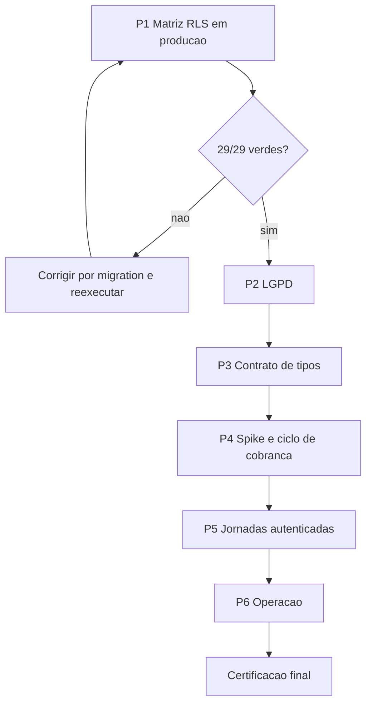

# PRD — Fechamento final do IS Arena, operando em produção

**Produto:** IS Arena
**Repositório:** `competition-conductor`
**Versão:** 3.0 — sucede o `PRD_FECHAMENTO_APLICACAO_100_PERCENT.md` (v2.0)
**Data:** 03/08/2026
**Commit de partida:** `acd373c`
**Banco:** projeto Supabase `lzjkvgvlfupklpmytvbr`, região `ca-central-1`, Postgres 17.6.1.141

---

## 1. Por que esta versão existe

A v2.0 foi escrita sobre hipóteses. A auditoria executada em 03/08/2026 derrubou a
principal delas e resolveu, com evidência, boa parte do que ela listava como pendente.
Esta versão substitui o plano inteiro pelo que sobrou de verdade.

### 1.1 O que a v2.0 errou

| Hipótese da v2.0 | Realidade verificada |
| --- | --- |
| Seis módulos são telas com dado de demonstração, sem tabela no backend | **Falso.** Todos têm tabela real e RPC dedicada. A fase FZ-1.5 inteira era desnecessária |
| A lacuna do banco é "migrations locais não aplicadas no remoto" | **Incompleto.** O drift era o oposto: 14 tabelas, 54 colunas e 11 funções existiam só em produção, sem nenhum `CREATE` no repositório |
| Não havia estimativa de esforço confiável | Continua verdade, mas agora o escopo real é muito menor |

### 1.2 O que já está resolvido

Tudo abaixo foi entregue e verificado nesta auditoria:

- **52 migrations, 52 aplicadas**, zero pendências;
- a cadeia completa **aplica em banco vazio** — antes abortava na 15ª migration com
  `relation "public.sanctions" does not exist`;
- 14 tabelas, 54 colunas, 11 funções, 31 constraints, 22 índices e 11 policies que
  existiam apenas em produção foram versionados;
- `types.ts` sincronizado com o schema real (+2 tabelas, +22 RPCs);
- 5 dos 29 casts removidos, e um defeito real que eles escondiam foi corrigido;
- bucket e policies de `team-media`, que nunca haviam chegado ao banco, reaplicados.

### 1.3 O achado que muda este plano

Os **29 scripts de verificação** em `supabase/tests/` foram escritos para não deixar
resíduo: 27 são transacionais e terminam em `ROLLBACK`, e 2 são somente leitura
(`phase1_matches_atomic` e `phase2_competition_engine` apenas fazem asserções sobre
`pg_indexes`, `has_table_privilege` e `to_regprocedure`). O único `COMMIT` encontrado é
a cláusula `ON COMMIT DROP` de uma tabela temporária.

**Consequência:** a matriz RLS pode ser executada contra o banco de produção sem
deixar uma única linha. A maior lacuna do produto é verificável sem infraestrutura
adicional.

---

## 2. Regra de ambiente

Decisão do responsável pelo produto: **não haverá ambiente de homologação.** Toda
verificação ocorre contra o banco de produção.

### 2.1 O que isso permite

Verificação transacional (`BEGIN … ROLLBACK`) e verificação somente leitura são
seguras e ficam liberadas sem cerimônia adicional.

### 2.2 O que isso proíbe

- executar script de verificação que não termine em `ROLLBACK` comprovado;
- rodar qualquer verificação sem antes confirmar o `ROLLBACK` por leitura do arquivo;
- deixar organização, usuário ou campeonato de verificação persistido após a execução;
- `supabase db reset`, `db push --force` ou qualquer comando destrutivo.

### 2.3 O que fica sem prova, e é assumido como risco

**Restauração de backup, RPO e RTO não podem ser comprovados.** Restaurar exige um
destino, e restaurar sobre a produção não é ensaio — é incidente. O requisito de
RPO ≤ 24 h e RTO ≤ 4 h da v2.0 **permanece não verificado** enquanto não existir um
segundo projeto Supabase.

Mitigação parcial, dentro da regra de ambiente:

- confirmar por leitura que o backup automático do Supabase está ativo e qual a
  janela de retenção do plano contratado;
- documentar o procedimento de restauração passo a passo, sem executá-lo;
- registrar formalmente que o item está **aceito como risco**, não **atendido**.

Isso precisa constar da certificação final. Declarar recuperação comprovada sem ter
restaurado seria falso.

### 2.4 Ponto cego permanente

`pg_dump` e `supabase db diff` **não enxergam o schema `storage`**. Buckets e policies
de Storage ficam fora de qualquer auditoria automática. Foi exatamente assim que o
bucket `team-media` ficou ausente por semanas com a migration marcada como aplicada.

Toda fase que toque em Storage exige verificação manual por consulta direta a
`pg_policies` e à API de buckets.

---

## 3. Estado verificado do back-end

Medido no dump de produção em 03/08/2026.

| Dimensão | Resultado |
| --- | --- |
| Tabelas | 70 |
| RLS habilitado | **70/70** |
| Tabelas com RLS e nenhuma policy | 12 — fail-closed, acesso só por RPC |
| Funções `SECURITY DEFINER` | 187 |
| Definer sem `SET search_path` | **0** |
| Policies de escrita alcançáveis por `anon` | **0** |
| Leituras públicas sem filtro de publicação | **0** |
| RPCs expostas | 174 |
| Buckets de Storage | 6 |
| Tabelas com `GRANT ALL` para `anon` | 26 — risco latente, hoje neutralizado pelo RLS |

As leituras públicas são gated no banco, não na interface: `championships` exige
`is_public AND status <> 'draft'`; `news` exige `published` ou `scheduled` vencido e
sem arquivamento; `media` exige `is_public AND published_at <= now()`; `sponsors`
exige vigência ativa.

---

## 4. Fases

### P1 — Executar a matriz RLS em produção

**Por que primeiro:** é a maior lacuna e o menor esforço. Os 29 scripts já existem.
Hoje a resposta para *"dois tenants estão isolados?"* é **não sei**. Se algum script
falhar, é defeito crítico e reordena todo o resto.

**Entregas**

1. Conferir, arquivo por arquivo, que cada script termina em `ROLLBACK` ou é somente
   leitura. Registrar a conferência.
2. Executar os 29 contra produção, capturando saída integral de cada um.
3. Para cada falha: classificar severidade, corrigir por migration, reexecutar.
4. Adicionar ao CI um job que roda a matriz contra o banco, com credencial de leitura
   e escrita transacional guardada em secret.
5. Incluir na matriz a verificação de privacidade de árbitros
   (`phase3_referee_privacy_verification.sql`), hoje fora do gate principal.

**Aceite:** 29/29 verdes, com saída anexada; job no CI executando em cada push.

**Evidência:** log de cada script, hash do commit, data.

---

### P2 — LGPD

**Por que segundo:** é exposição jurídica, não dívida técnica. O produto guarda
documento, data de nascimento, telefone e foto de atletas — **incluindo menores em
categorias de base** — e os dados residem no **Canadá**, o que caracteriza
transferência internacional.

**Entregas**

1. Definir e documentar a base legal do tratamento de dado de atleta menor de idade
   (consentimento do responsável ou execução de contrato pela entidade esportiva).
   Este PRD não substitui aconselhamento jurídico.
2. Documentar a residência física dos dados (`ca-central-1`) e a transferência
   internacional no aviso de privacidade.
3. Implementar RPC de **exportação** dos dados de um titular e de uma organização.
4. Implementar RPC de **exclusão/anonimização em cascata** sobre atletas, responsáveis
   e staff vinculados, preservando o histórico esportivo desvinculado de PII.
5. Definir a política de retenção pós-cancelamento de organização, distinta da
   retenção de auditoria de 60 meses.
6. Registrar ambas as operações em `audit_logs`.

**Aceite:** titular exporta e exclui seus dados sem intervenção manual no banco;
exclusão não quebra integridade referencial nem apaga histórico esportivo agregado.

**Evidência:** script transacional demonstrando exportação e cascata, com `ROLLBACK`.

---

### P3 — Fechar o contrato de tipos

**Entregas**

1. Remover os 24 casts restantes, seguindo o padrão já estabelecido em
   `competition-engine.service.ts`:
   - wrapper genérico sobre `keyof Functions`, nunca cast em `supabase.rpc`;
   - tipo `RpcArgs<N>` permitindo `null`, porque o gerador do Supabase não expressa
     parâmetro anulável (`DEFAULT NULL` vira opcional, nunca `| null`);
   - helper `asJson()` marcando cada payload `jsonb` individualmente;
   - narrowing do retorno na fronteira do serviço quando a RPC devolve `jsonb`.
2. Prioridade dentro da fase: os 4 casos de
   `supabase as unknown as SupabaseClient` — destipam o cliente inteiro, não uma
   chamada. Estão em `athletes`, `championship-logo.service`, `TeamPeoplePage` e
   `team-registration.functions`.
3. Corrigir todo defeito que o typecheck revelar ao religar a checagem — foi assim
   que apareceu o `p_fingerprint` recebendo `null` onde o contrato exige
   `string | undefined`.

**Aceite:** zero cast sobre `supabase.rpc` ou sobre o cliente; os casts remanescentes
são exclusivamente narrowing de `jsonb`, cada um com comentário justificando.

---

### P4 — Cobrança: spike antes de código

**Entregas**

1. **Spike InfinitePay, bloqueante.** Confirmar na documentação oficial se existe
   cobrança recorrente nativa. A v2.0 registrou que **não existe** — a recorrência é
   um motor interno sobre checkout avulso. Confirmar antes de escrever qualquer linha.
2. Auditar o que já está construído contra o desenho correto: `billing_checkout_orders`,
   `billing_provider_events`, `prepare_subscription_checkout`,
   `confirm_infinitepay_subscription_payment`, `attach_subscription_checkout_url`,
   `reconcile_expired_organization_subscriptions` já existem.
3. Garantir que o webhook seja tratado como **gatilho**, nunca fonte de verdade:
   toda mudança de estado confirmada por `payment_check` servidor-a-servidor.
4. Idempotência por `order_nsu`/`transaction_nsu`.
5. Definir a janela de tolerância de `past_due` antes de suspender acesso.
6. Executar **um checkout real de valor mínimo** em produção, com webhook real, e
   registrar o ciclo completo.
7. Executar o job de reconciliação uma vez e registrar a saída.

**Aceite:** ciclo completo comprovado no runtime publicado; webhook repetido não
duplica estado.

**Ressalva de ambiente:** por não haver staging, o teste de cobrança usa dinheiro
real em valor mínimo. Prever o estorno.

---

### P5 — Jornadas autenticadas

**Entregas**

1. Criar **uma** organização de verificação em produção, com prefixo identificável
   (por exemplo `zz-verificacao-`), e script de remoção idempotente.
2. Implementar as jornadas críticas como specs Playwright autenticadas, escrevendo
   apenas dentro dessa organização.
3. Priorizar, das 27 jornadas da v2.0, as que cobrem risco real:
   E01 acesso, E03 papéis e último owner, E09 partida e eventos, E10 homologação,
   E11 classificação e suspensões, E15 financeiro com estorno, E22 negação
   cross-tenant, E23 negação de System Admin, E24 viewport móvel.
4. Substituir no CI o smoke contra `https://example.supabase.co` — endereço falso —
   por execução real.
5. Corrigir a métrica de cobertura: hoje 87% são medidos sobre 9 arquivos de util e
   180 statements, sem nenhum serviço ou regra de negócio. O número está verde e é
   enganoso.

**Aceite:** jornadas verdes no CI; organização de verificação removida ao fim de cada
execução, comprovado por consulta.

---

### P6 — Operação

**Entregas**

1. Health check de aplicação, banco, Storage, billing e jobs.
2. Erros de cliente e servidor em ferramenta nomeada (Sentry ou equivalente).
3. Alerta por severidade com teste real de disparo.
4. Runbook de indisponibilidade, falha de billing, falha de migration e incidente de
   segurança.
5. Cron de assinatura monitorado.
6. Retenção de auditoria de 60 meses aplicada e verificada.
7. Plano de rollback de aplicação, ensaiado.
8. **Verificação de Storage**, que nenhuma ferramenta automática cobre: comparar
   `storage.buckets` e as policies de `storage.objects` com o que as migrations criam.

**Aceite:** alerta real chega ao responsável; runbook permite resposta sem
conhecimento tribal.

---

## 5. Dívidas fora do back-end

Registradas para não se perderem, mas **fora do escopo deste PRD** por decisão do
responsável:

- **CI vermelho.** `npm run lint` falha na `main` com 285 erros, todos
  `prettier/prettier`: 266 em `docs/novo-layout/mockup/support.js` (mockup
  vendorizado, deveria entrar no `ignores` do ESLint) e 19 em 5 arquivos do commit
  de layout `086cec2`. Nenhum é de back-end e todos são auto-corrigíveis com
  `eslint --fix`. Enquanto não for tratado, **o gate de qualidade do CI não passa**,
  o que bloqueia o aceite de qualquer fase que dependa de CI verde.

---

## 6. Ordem e gates

| Gate | Condição |
| --- | --- |
| G1 — Isolamento | 29/29 scripts verdes, com saída anexada |
| G2 — Dados pessoais | exportação e exclusão funcionam de ponta a ponta |
| G3 — Contrato | zero cast sobre `supabase.rpc` ou sobre o cliente |
| G4 — Comercial | checkout, webhook e reconciliação comprovados em produção |
| G5 — Jornadas | specs autenticadas verdes no CI, sem resíduo |
| G6 — Operação | alerta real disparado, runbooks escritos, rollback ensaiado |

---

## 7. Certificação final

Só pode ser emitida com resposta **Sim** a todas:

- Os 29 scripts de isolamento passaram, com saída registrada?
- Um titular consegue exportar e excluir seus dados sem intervenção manual no banco?
- O contrato de tipos reflete o schema, sem cast escondendo divergência?
- O ciclo de cobrança rodou de verdade, com webhook confirmado por `payment_check`?
- As jornadas críticas passam autenticadas, sem deixar resíduo em produção?
- Existe alerta que chega a um humano quando algo quebra?
- O commit certificado é exatamente o commit implantado?

E com **uma resposta Não registrada de propósito**:

- A restauração de backup foi comprovada? **Não.** Aceito como risco por não haver
  ambiente alternativo, conforme a seção 2.3.

Declarar o contrário seria falso.
